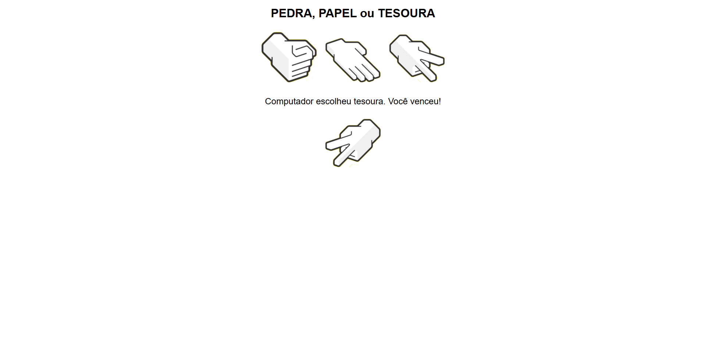

# Pedra, Papel e Tesoura (Jokempo)
Este é um jogo simples desenvolvido em **HTML**, **CSS** e **JavaScript** para jogar Pedra, Papel e Tesoura contra a máquina.

---

### Como Jogar:

- ### Primeiro método: Execute ON-LINE

1. Basta clicar no meu link ao lado dos arquivos do jogo.

    ```
        https://joaomarceloguastala.github.io/pedraPapelTesouraFrontEnd/
    ```

- ### Segundo método: Clonando o repositório

1. Clone este repositório Git:
    ```bash
    git clone https://github.com/JoaoMarceloGuastala09/pedra-papel-tesoura.git
    ```
2. Abra o arquivo `index.html` em seu navegador.
    - Não é necessário baixar mais nenhum arquivo externo, basta executar o `index.html` e se divertir.

- ### Terceiro método: Baixando o arquivo ZIP

1. Clique em `<> Code`, se o seu estiver em português: `<> Código`.
2. Depois clique em `Download ZIP`, se o seu estiver em português: `Baixar ZIP`.
3. Abra seu gerenciador de arquivos e extraia a pasta, clicando nela com o botão **direito** e depois em **Extrair aqui**.
4. Execute o arquivo `index.html` e se divirta.

---

### O que foi utilizado:    
- **HTML**: Estrutura básica do site.
- **CSS**: Estilo do site (deixa bonitinho).
- **JavaScript**: Lógica do jogo e como ele interage com o usuário.

---

### Sobre o desenvolvimento: 
Posso considerar o HTML e o CSS as partes mais fáceis desse código, já que foi apenas importar as imagens e configurar as opções padrão de um site. Já o JavaScript foi bem mais difícil, pois eu sabia bem pouco sobre sua lógica, então boa parte dele foi feita com base em pesquisas realizadas no momento.

---

### ℹ Observações:    
Esse jogo foi feito para melhorar minhas habilidades em desenvolvimento web (que não são das melhores), então não espere muito.

---

### Imagem do jogo:
Aqui está a tela final do jogo Pedra, Papel e Tesoura: 

---

### Licença:
Este projeto está licenciado sob a [MIT License](https://opensource.org/licenses/MIT).

---

Obrigado e até mais, terráqueos! 


---
Acesse o repositório do projeto [aqui](https://github.com/JoaoMarceloGuastala/pedraPapelTesouraFrontEnd.git)
